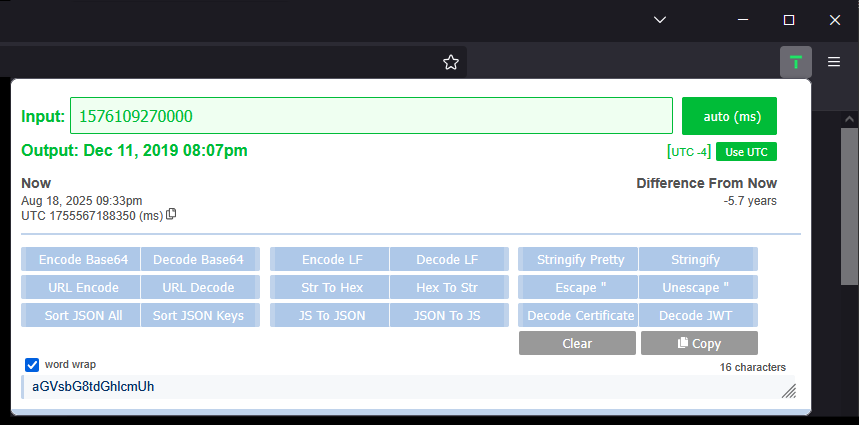

# Timely

**This is a Firefox extension.**

Convert unix timestamps to readable dates and vice versa. Also includes various string formatting utilities (such as base 64 encoding, base 64 decoding, hex encoding, JSON pretty printing, encode URI component etc...).

Save time with Timely.

1. Click the "t" to open it
2. Paste your timestamp into the input box
3. Watch in amazement as your timestamp becomes readable by most humans
4. Try it the other way around! (type a date in the input)

